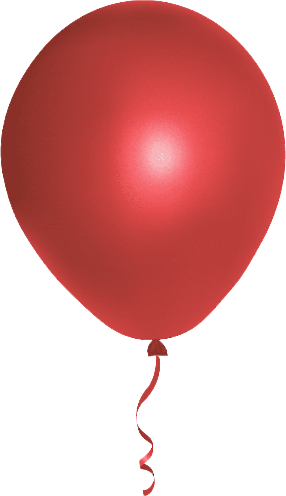
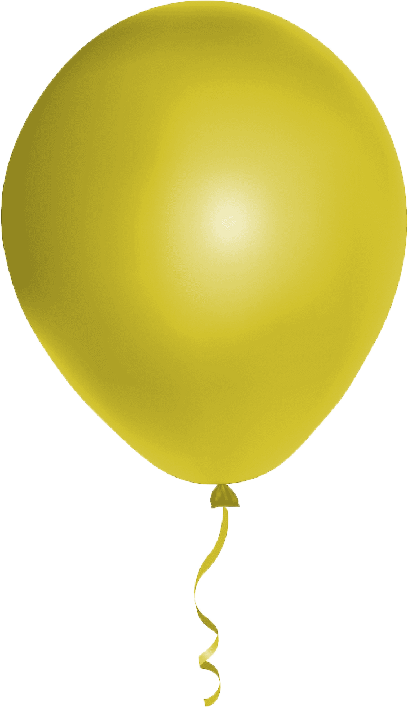

# Emily Mills
Spring 2021 - Web Design Principles

** Last updated 4/4/21**

I, Emily Mills, have read the point deduction list and understand that I will lose points for missing items.

## Resources
For more information on the balloon animation visit https://www.w3schools.com/css/css3_animations.asp

## Images
The images used in this document can be are as follows:

